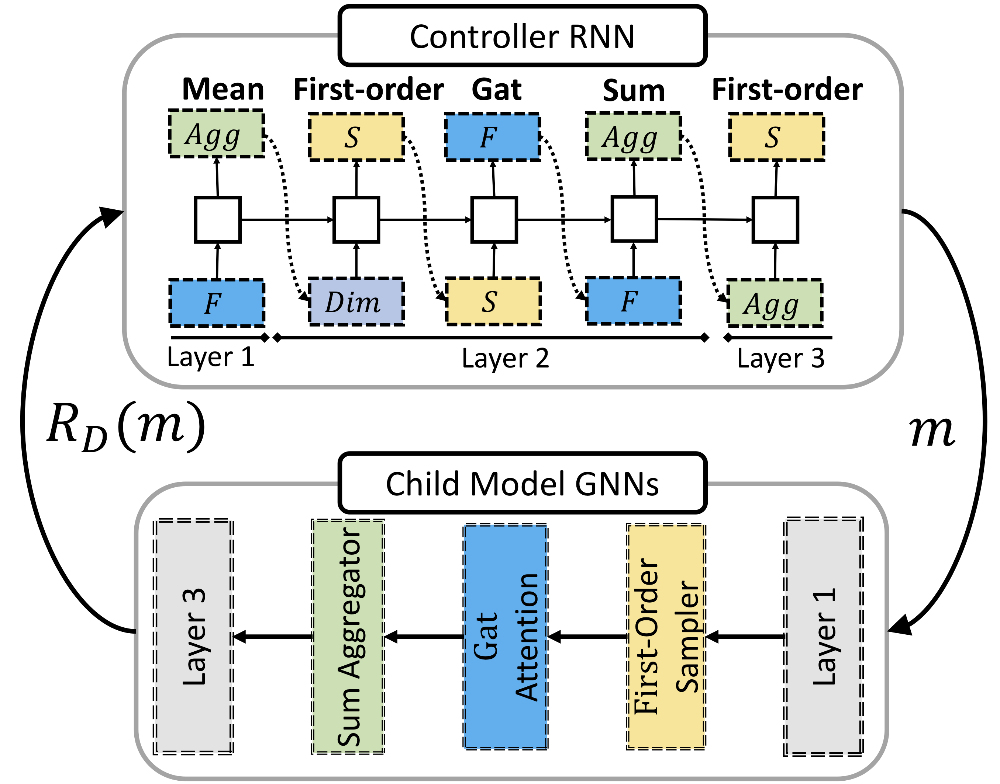
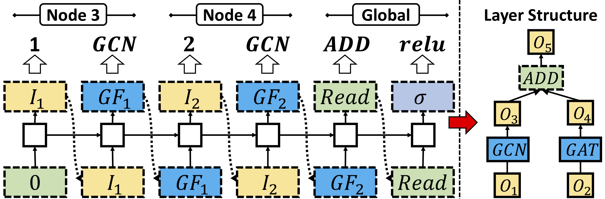
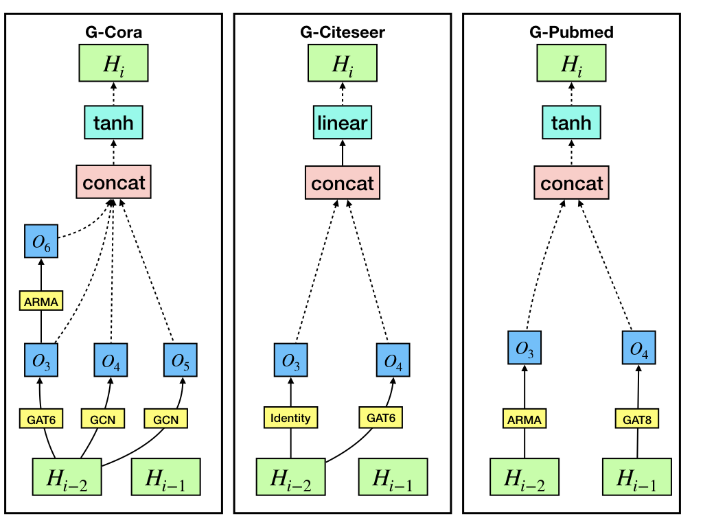

# GraphNAS

#### Overview
Graph Neural Architecture Search (GraphNAS for short) enables automatic design of the best graph neural architecture 
based on reinforcement learning. 
This directory contains code necessary to run GraphNAS. 
Specifically, GraphNAS first uses a recurrent network to generate variable-length strings 
that describe the architectures of graph neural networks, and then trains the recurrent network 
with a policy gradient algorithm to maximize the expected accuracy of the generated architectures on a validation data set. 
An illustration of GraphNAS is shown as follows:

A recurrent network (Controller RNN) generates descriptions of graph neural architectures (Child model GNNs). 
Once an architecture  is generated by the controller, 
GraphNAS trains the architecture m on a given graph  and 
test  
on a validate set . 
The validation result ) is taken as the reward of the recurrent network.

  
  
   
   
To improve the search efficiency of GraphNAS, we restrict the search space from an entire architecture to a 
concatenation of the best search results built on each single architecture layer. 
An example of GraphNAS constructing a single GNN layer (the right-hand side) is shown as follows:

 

In the above example, the layer has two input states  and , two intermediate states  and , 
and an output state . The controller at the left-hand side samples  from  
and takes  as input of , and then samples "GAT" for processing . The output state ) 
collects information from  and , and the controller assigns a readout operator "add" and an activation operator 
"relu" for . As a result, this layer can be described as a list of operators: [0, gcn, 1, gat, add, relu].

#### Requirements
Recent versions of PyTorch, numpy, scipy, sklearn, dgl, torch_geometric and networkx are required.
Ensure that PyTorch 1.1.0 and CUDA 9.0 are installed. Then run:
    
    pip install torch==1.1.0 -f https://download.pytorch.org/whl/cu90/torch_stable.html
    pip install -r requirements.txt

If you want to run in docker, you can run:

    docker build -t graphnas -f DockerFile . 
    docker run -it -v $(pwd):/GraphNAS graphnas python -m eval_scripts.semi.eval_designed_gnn

#### Running the code
##### Architecture evaluation
To evaluate our best architecture designed on semi-supervised experiments by training from scratch, run

    python -m eval_scripts.semi.eval_designed_gnn

To evaluate our best architecture designed on semi-supervised experiments by training from scratch, run

    python -m eval_scripts.sup.eval_designed_gnn
###### Results
Semi-supervised node classification w.r.t. accuracy

Model| Cora | Citeseer | Pubmed
|-|-|-|-| 
GCN    | 81.5+/-0.4 | 70.9+/-0.5   | 79.0+/-0.4  
SGC    |  81.0+/-0.0 |   71.9+/-0.1   |  78.9+/-0.0   
GAT    |  83.0+/-0.7  |  72.5+/-0.7   | 79.0+/-0.3    
LGCN    |  83.3+/-0.5  | 73.0+/-0.6    |  79.5+/-0.2   
DGCN    |  82.0+/-0.2  | 72.2+/-0.3    |  78.6+/-0.1   
ARMA    |  82.8+/-0.6  | 72.3+/-1.1    |  78.8+/-0.3   
APPNP   |  83.3+/-0.6  | 71.8+/-0.4    |  80.2+/-0.2   
simple-NAS |  81.4+/-0.6  |  71.7+/-0.6    |  79.5+/-0.5  
GraphNAS | **84.3+/-0.4**  | **73.7+/-0.2**    | **80.6+/-0.2**  
		
Supervised node classification w.r.t. accuracy	

Model| Cora | Citeseer | Pubmed  
|-|-|-|-| 
GCN    | 90.2+/-0.0  | 80.0+/-0.3   | 87.8+/-0.2  
SGC    | 88.8+/-0.0 |  80.6+/-0.0   |   86.5+/-0.1  
GAT    |  89.5+/-0.3  |  78.6+/-0.3    |  86.5+/-0.6   
LGCN    | 88.7+/-0.5  | 79.2+/-0.4     |  OOM    
DGCN    |  88.4+/-0.2  |  78.0+/-0.2    |  88.0+/-0.9    
ARMA    |  89.8+/-0.1  |  79.9+/-0.6    |  88.1+/-0.2    
APPNP    | 90.4+/-0.2  | 79.2+/-0.4     | 87.4+/-0.3    
random-NAS | 90.0+/-0.3   |  81.1+/-0.3    | 90.7+/-0.6    
simple-NAS | 90.1+/-0.3  |  79.6+/-0.5    |  88.5+/-0.2  
GraphNAS | **90.6+/-0.3**   |  **81.3+/-0.4**   | **91.3+/-0.3**    
	
Architectures designed in supervised learning are showed as follow:

The architecture G-Cora designed by GraphNAS on Cora is [0, gat6, 0, gcn, 0, gcn, 2, arma, tanh, concat], 
the architecture G-Citeseer designed by GraphNAS on  Citeseer is [0, identity, 0, gat6, linear, concat], 
the architecture G-Pubmed designed by GraphNAS on  Pubmed is [1, gat8, 0, arma, tanh, concat]. 

##### Searching for new architectures
To design an entire graph neural architecture based on the search space described in Section 3.2, please run: 

    python -m graphnas.main --dataset Citeseer

To design an entire graph neural architecture based on the search space described in Section 3.4, please run: 
    
    python -m graphnas.main --dataset Citeseer --supervised True --search_mode micro

Be aware that different runs would end up with different local minimum.

#### Acknowledgements
This repo is modified based on [DGL](https://github.com/dmlc/dgl) and [PYG](https://github.com/rusty1s/pytorch_geometric).
